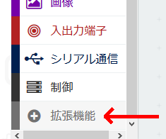
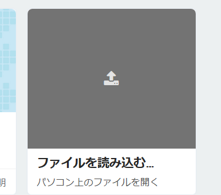
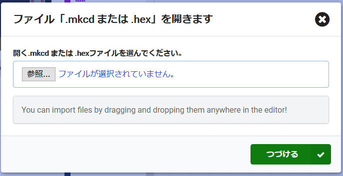
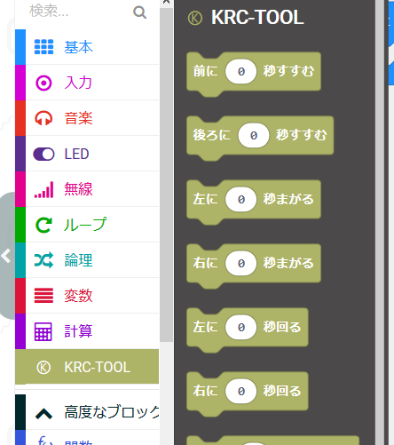
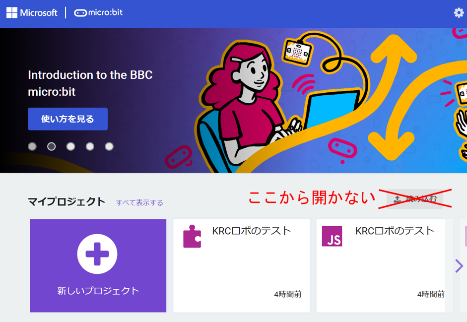
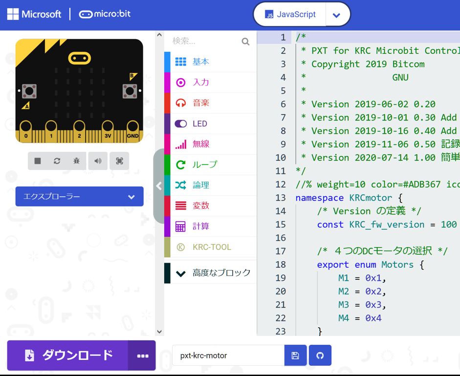
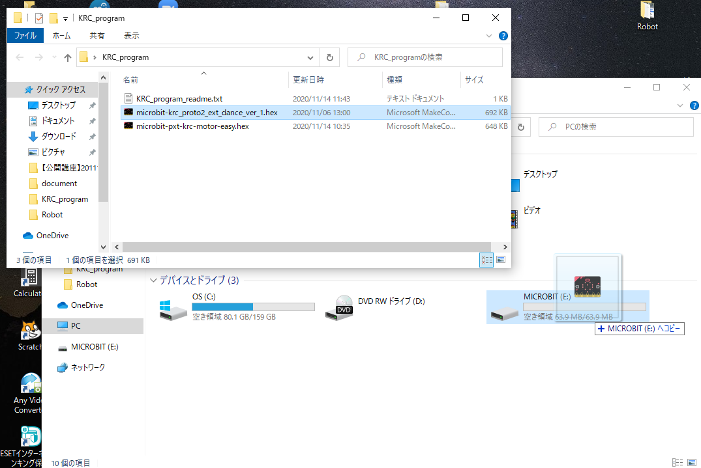

# KRC拡張ブロック追加方法

あらかじめMicrosoft Storeで「make code」で検索して[make code for micro:bit]をインストールする。

### 拡張プログラム

- Microbitでのプログラミング用: 
    microbit-pxt-krc-motor-easy.hex

- コントローラー制御・ティーチング用（通常プログラム）: 
microbit-KRC_robot_.hex
（microbit-krc_proto2_ext_dance_ver_1.hex）

- 無線通信用操作用: 
microbit-krc_radio_controller.hex

---

## Microbitでのプログラミング用ライブラリー

１．KRC_Library/for_programingにある「microbit-pxt-krc-for-programing.hex」を自分のPCにコピーする。

[KRC_Library/for_programing](./KRC_Library/for_programing/)

※このファイルをドラックアンドドロップで読み込ませないでください!

２．makecodeを立ち上げ、拡張機能を押す

３．拡張機能の一番下にスクロールし「ファイルを読み込む」を押す
※一番下にあります。

４．「参照」を押してPCにコピーした「microbit-pxt-krc-for-programing.hex」ファイルを指定して、つづけるを押す

５．KRCTOOLブロックが追加されます

### ★注意事項

アプリまたはオンラインエディタの最初で、「microbit-pxt-krc-for-programing.hex」を開いてしまうと、ブロックの開発モードになってしまい、通常のブロック利用ができません。
必ず新しいプロジェクトで開いたあとで、「拡張機能」→「ファイルを読み込む」から開いてください。

もし、下記のようになってしまったら、再度新しいプロジェクトを開いて上記の手順通りに行ってください。

---

## コントローラー制御・ティーチング用（通常プログラム）

KRC_Library/for_button_cotrol にある「microbit-KRC_robot_.hex」
のファイルをMicrobitにドロップアンドドロップしてください。

[KRC_Library/for_button_cotrol](./KRC_Library/for_button_control/)

MicrobitのLEDに「０」、「A」が表示されていれば元に戻っています。

詳しくは、[microbit_for_button_controll.pdf](./KRC_library/microbit_for_button_controll.pdf)を参照してください。

---

## 無線通信用操作用

Microbitが2個必要用です。
ロボット側のMicrobitにKRCのコントローラー制御・ティーチング用（通常プログラム）を入れ、MicrobitのLED「A」モードになっている場合、以下のプログラムをもう一つのMicrobitに入れることで無線操作できます。

microbit-krc_radio_controller.hex
のファイルを操縦側のMicrobitにドロップアンドドロップしてください。

MicrobitのLEDに「０」が表示されます。
ABボタンを両方押して無線チャンネルを選んで下さい。ロボット側も同じようにABボタンを両方押して同じ無線チャンネルにしてください。

詳しくは、[microbit_for_button_control.pdf](./KRC_library/microbit_for_button_control.pdf)を参照してください。

