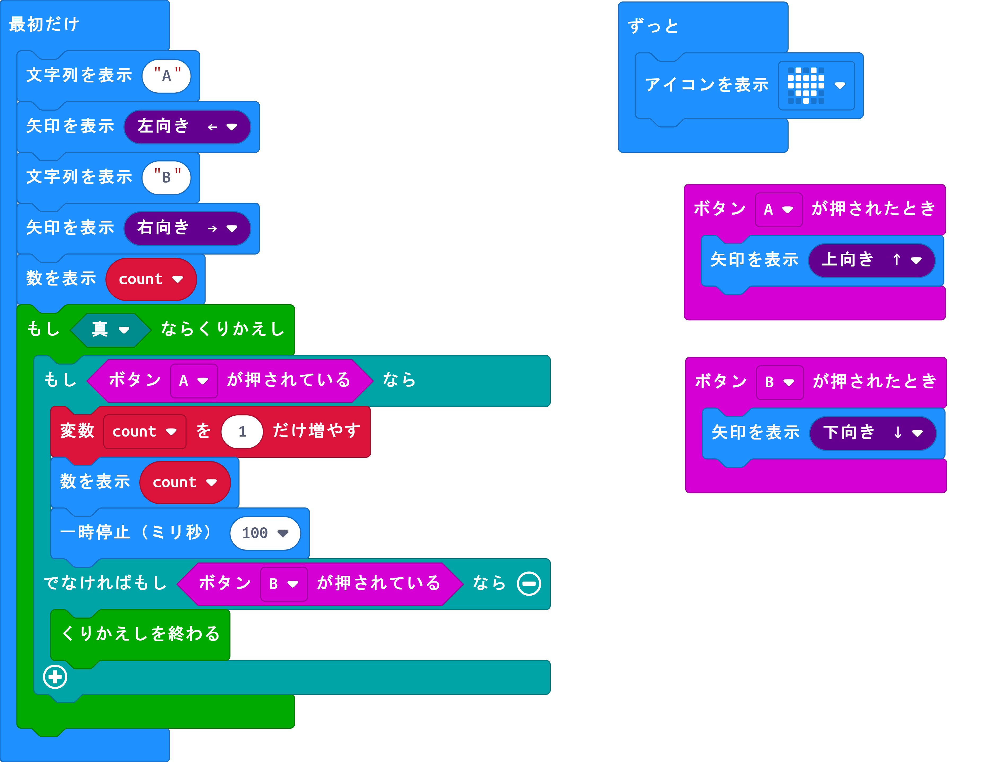

# Microbit snipet

## 初期設定

最初だけブロック内にA、Bボタンを使って初期値を設定する。



##### コード

```python
#　AB_ini_set
def on_button_pressed_a():
    basic.show_arrow(ArrowNames.NORTH)
input.on_button_pressed(Button.A, on_button_pressed_a)

def on_button_pressed_b():
    basic.show_arrow(ArrowNames.SOUTH)
input.on_button_pressed(Button.B, on_button_pressed_b)

count = 0
basic.show_string("A")
basic.show_arrow(ArrowNames.WEST)
basic.show_string("B")
basic.show_arrow(ArrowNames.EAST)
basic.show_number(count)
while True:
    if input.button_is_pressed(Button.A):
        count += 1
        basic.show_number(count)
        basic.pause(100)
    elif input.button_is_pressed(Button.B):
        break

def on_forever():
    basic.show_icon(IconNames.HEART)
basic.forever(on_forever)
```

##### コードの解説

最初にcount変数を0に設定する。

Aボタンが押されると1増える。

Bボタンを押すと決定してループを抜ける。

例えば、通信チャンネルの設定に使うことができる。

---

## Micro:bitのボタンのOn/Offスイッチ動作

Microbitでロボットなどを操作する際に、ボタンの数が足りなくなることがあります。

例えば、Aボタンを押してモーターをスタート、Bボタンを押してモータをストップ。この場合2つのボタンが必要になります。
 Aボタンを押してスタート、もう一度Aボタンを押すとストップというような、スイッチ機能があると使用するボタンの数も減らすことができます。


#### コード

```python
def on_button_pressed_a():
    global status
    if status == 0:
        status = 1
        basic.show_number(status)
    else:
        status = 0
        basic.show_number(status)
input.on_button_pressed(Button.A, on_button_pressed_a)

status = 0
status = 0
basic.show_number(status)
```

---


## コンパスの使い書いた

[micro:bitを構成する部品(背面)](https://webcache.googleusercontent.com/search?q=cache:bLXc4MjqfqQJ:https://sanuki-tech.net/micro-bit/overview/hardware-back/+&cd=2&hl=ja&ct=clnk&gl=jp&client=firefox-b-d)

地磁気センサー(コンパス)で、方位を知ることができます。取得できる値は、北を基点として時計回りに、0～359。(北:0、東:90、南:180、西:270)

地磁気センサーを使用する場合、最初にキャリブレーション(較正)が必要です。プログラム実行時に、キャリブレーションが必要かどうかを自動的に判断して、LED画面に「TILT TO FILL SCREEN」と表示されます。micro:bitを傾けながら、LED画面をすべて点灯させると、キャリブレーション終了です


[【入門用】つねに「北」を指し示す矢印](https://sanuki-tech.net/micro-bit/appendix-sample-program/compass-2/)


```python
方角 = 0

def on_forever():
    global 方角
    方角 = input.compass_heading()
    if 方角 < 23:
        basic.show_arrow(ArrowNames.NORTH)
    elif 方角 < 68:
        basic.show_arrow(ArrowNames.NORTH_WEST)
    elif 方角 < 113:
        basic.show_arrow(ArrowNames.WEST)
    elif 方角 < 158:
        basic.show_arrow(ArrowNames.SOUTH_WEST)
    elif 方角 < 203:
        basic.show_arrow(ArrowNames.SOUTH)
    elif 方角 < 248:
        basic.show_arrow(ArrowNames.SOUTH_EAST)
    elif 方角 < 293:
        basic.show_arrow(ArrowNames.EAST)
    elif 方角 < 338:
        basic.show_arrow(ArrowNames.NORTH_EAST)
    else:
        basic.show_arrow(ArrowNames.NORTH)
basic.forever(on_forever)

```

---

## messaging test  name-value

name,  valueで通信する


```python
def on_button_pressed_a():
    radio.send_value("abc", randint(0, 10))
input.on_button_pressed(Button.A, on_button_pressed_a)

def on_button_pressed_b():
    radio.send_value("efg", randint(11, 20))
input.on_button_pressed(Button.B, on_button_pressed_b)

def on_received_value(name, value):
    basic.show_string(name)
    basic.show_number(value)
radio.on_received_value(on_received_value)

radio.set_group(1)
basic.show_number(1)
```