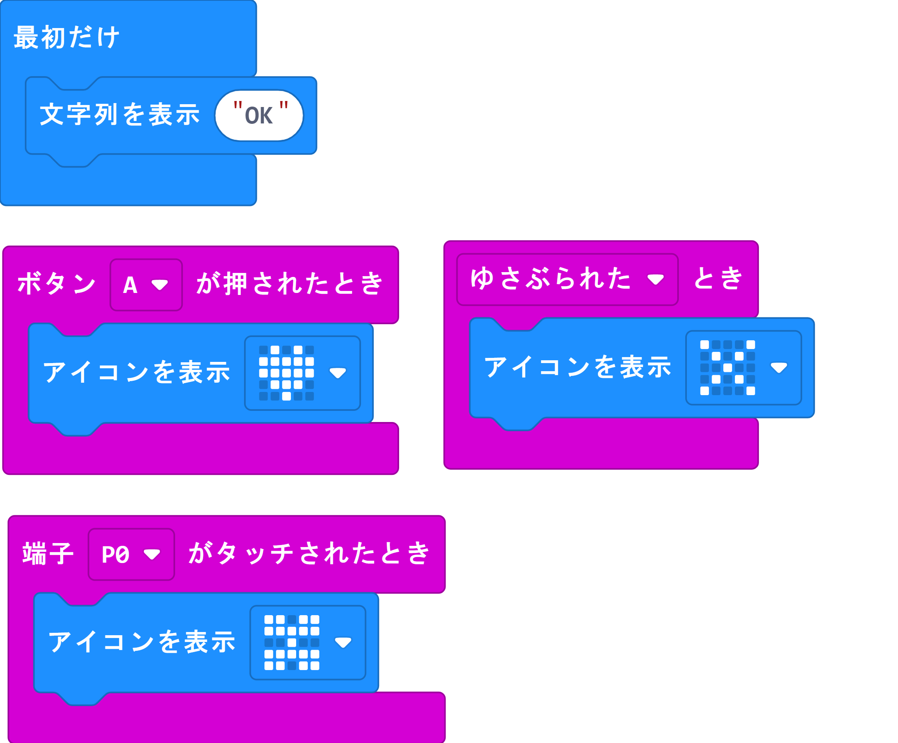

https://gitpitch.com/SGyutan/Microbit_tutorial

---
# Micro:bit tutorial

---
### はじめに

@size[1.1em](Micro:bitのブロックエディターを使って、プログラミングの基本を学びます。

プログラミングの基本は以下の通りです。（一般的なプログラミング言語の教科書に書かれているものです。）

（1）表示：プログラムの結果を表示する方法

（2）繰り返し：プログラムは繰り返し動作が得意ですので、繰り返しを行う方法

（3）条件分岐：ある条件によって動作を変更させる方法

（4）変数：結果などを変数に入れることで他でもその値を利用できるようにする方法

（5）関数：動作をまとめる方法（省略）

（6）イベント：ある入力イベント（ボタンが押されるなど）によって実行する動作を制御する方法

（7）内臓センサー利用：内蔵されているセンサーを利用する方法

（8）無線通信：他のMicrobitと通信する方法

なお、（1）-（6）までは、他の言語にも共通する内容です。
（7）、（8）はマイクロビット独自の機能です。
)
---

### Lesson 1  LED表示＆繰り返し

@size[1.1em](MicrobitのLEDを使って表示します。)
“最初だけ”ブロックでは、最初の一回のみブロックの中が実行されます。
“ずっと”ブロックでは、繰り返し行われます。(※他のプログラム言語では“ずっと”は“while loop”といわれます。)

---
### Lesson 2  変数＆条件分岐＆繰り返し

乱数を使って条件分岐を行います。

---
### Lesson 3  イベント

イベントは、ボタンが押される、傾けるなどのイベントに対応してプログラムを実行します。

---
### Lesson 4 内臓センサー

Microbitに内蔵されているセンサーの値を表示させます。

---
### Lesson 5  無線通信

Microbitを2つ使って無線通信を行います。
送信側のAボタンを押すと「Hi」が送信側LEDに「Hi」が表示され、受信側のLEDにも「Hi」が表示されます。

