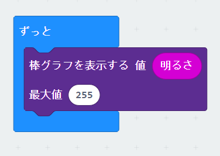
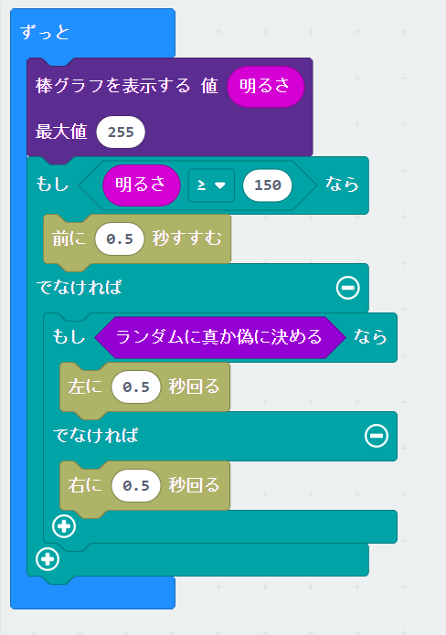
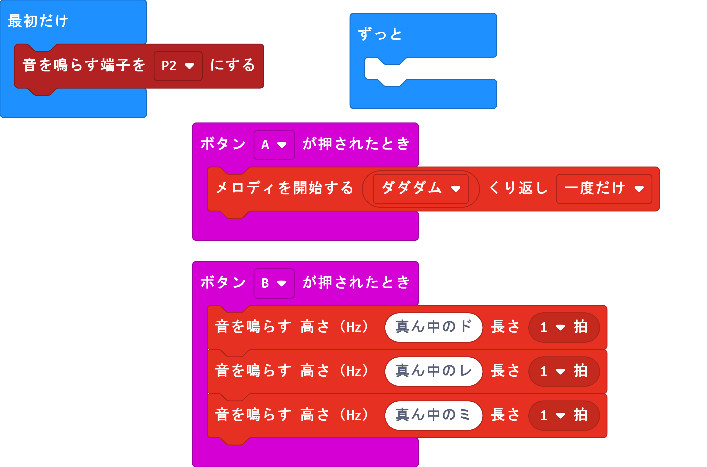

# アドバンスコース

## ロボットを動かす(動作確認)

拡張ブロックを追加します。
追加方法は、「KRC_library_setup.pdf」のドキュメントを参照してください。


動くかどうか試してみましょう。
ロボットの動く方向（右、左、前進、後進）が思った通りに動いているか確認してください。


```javascript
input.onButtonPressed(Button.A, function () {
    KRCmotor.FwdGo(2)
    KRCmotor.FwdRotate(2)
    KRCmotor.RevRotate(2)
    KRCmotor.StopAll(1)
    KRCmotor.RevGo(2)
})
input.onButtonPressed(Button.B, function () {
    KRCmotor.LeftTurn(2)
    KRCmotor.RightTurn(2)
    KRCmotor.LeftSpin(2)
    KRCmotor.RightSpin(2)
    KRCmotor.FwdGo(3)
    KRCmotor.RevGo(3)
})
basic.showString("OK")
basic.clearScreen()
basic.forever(function () {
	
})
```

課題：コースをうまく移動できるように時間を調節してプログラムを組んでみてください。


---
## 光強度の測定と閾値の決定



```javascript
basic.forever(function () {
    led.plotBarGraph(
    input.lightLevel(),
    255
    )
})
```

ロボットにつけた時に明るさを測定してください。


---
## 光制御プログラム

光を当てる（閾値より強い光を当てる）と前に進みます。光が当たっていないときには、光のある方を探索します。





```javascript
basic.forever(function () {
    led.plotBarGraph(
    input.lightLevel(),
    255
    )
    if (input.lightLevel() >= 150) {
        KRCmotor.FwdGo(0.5)
    } else {
        if (Math.randomBoolean()) {
            KRCmotor.LeftSpin(0.5)
        } else {
            KRCmotor.RightSpin(0.5)
        }
    }
})
```

探索プログラムを考えてみてください。


---


#### KRCの通常のプログラム（ボタンスイッチの制御）に戻す方法

microbit-krc_proto2_ext_dance_ver_1.hex
のファイルをMicrobitにドロップアンドドロップしてください。
MicrobitのLEDに「０」、「A」が表示されていれば元に戻っています。


---


#### サウンド出力でKRCのボードを使う場合

出力端子の変更が必要です。「入出力端子」->「その他」->「音を鳴らす端子を・・にする」を[「最初だけ」に置いて出力端子をP2に変更してください。

KRCボードは、出力端子のP0をほかの制御に使っているために、そのまま使用すると誤作動を起こします。




```javascript
input.onButtonPressed(Button.A, function () {
    music.startMelody(music.builtInMelody(Melodies.Dadadadum), MelodyOptions.Once)
})
input.onButtonPressed(Button.B, function () {
    music.playTone(262, music.beat(BeatFraction.Whole))
    music.playTone(294, music.beat(BeatFraction.Whole))
    music.playTone(330, music.beat(BeatFraction.Whole))
})
pins.analogSetPitchPin(AnalogPin.P2)

```

---