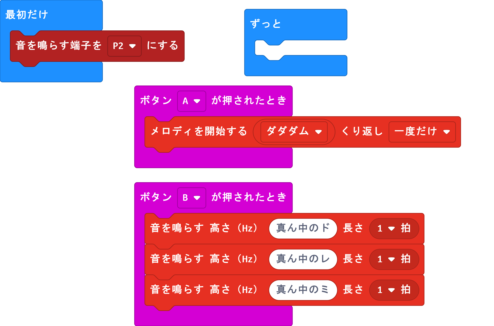

#アドバンスコース　追加プログラム
### ロボットを動かす

拡張ブロックを追加します。
追加方法は、「KRC拡張ブロックの追加方法」のドキュメントを参照してください。

動くかどうか試してみましょう。


```javascript
input.onButtonPressed(Button.A, function () {
    KRCmotor.FwdGo(1)
    KRCmotor.FwdRotate(1)
    KRCmotor.RevRotate(1)
    KRCmotor.StopAll(1)
    KRCmotor.RevGo(1)
})
basic.showString("OK")
basic.clearScreen()
basic.showString("A")
basic.forever(function () {
	
})
```


コースをうまく移動できるように時間を調節してプログラムを組んでみてください。


### 音楽を鳴らす

Microbitでは音を鳴らすことができます。
Microbitに既に入っている音を鳴らしてみましょう。

端子0をイヤホンの中心に、端子GNDを外側に接続します。


```javascript
input.onButtonPressed(Button.A, function () {
    music.startMelody(music.builtInMelody(Melodies.Dadadadum), MelodyOptions.Once)
})
input.onButtonPressed(Button.B, function () {
    music.playTone(262, music.beat(BeatFraction.Whole))
    music.playTone(294, music.beat(BeatFraction.Whole))
    music.playTone(330, music.beat(BeatFraction.Whole))
})
basic.forever(function () {
	
})
```


####　KRCのボードを使う場合

出力端子の変更が必要です。「入出力端子」->「その他」->「音を鳴らす端子を・・にする」を最初だけに置いてP2に変更してください。




```javascript
input.onButtonPressed(Button.A, function () {
    music.startMelody(music.builtInMelody(Melodies.Dadadadum), MelodyOptions.Once)
})
input.onButtonPressed(Button.B, function () {
    music.playTone(262, music.beat(BeatFraction.Whole))
    music.playTone(294, music.beat(BeatFraction.Whole))
    music.playTone(330, music.beat(BeatFraction.Whole))
})
basic.forever(function () {
	
})
```

