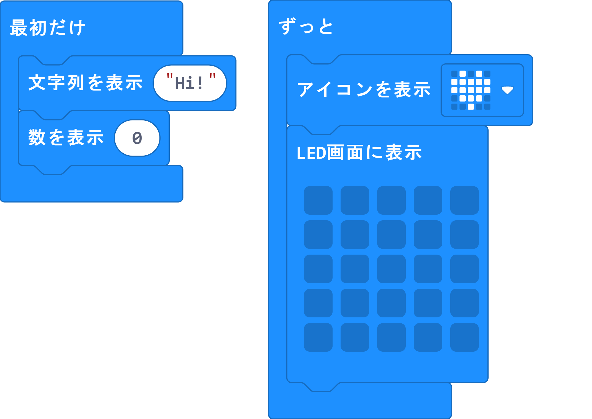
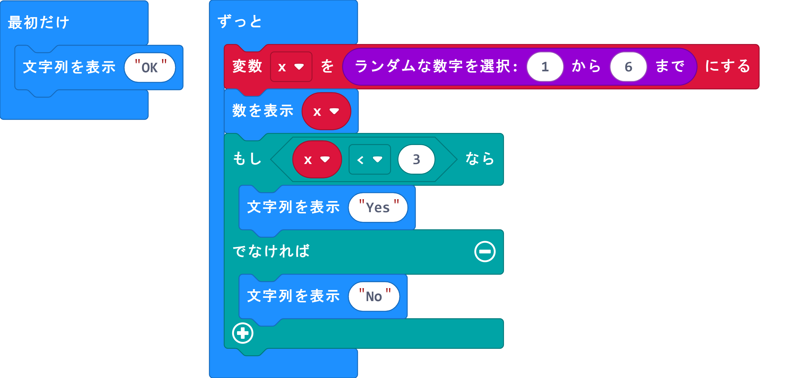
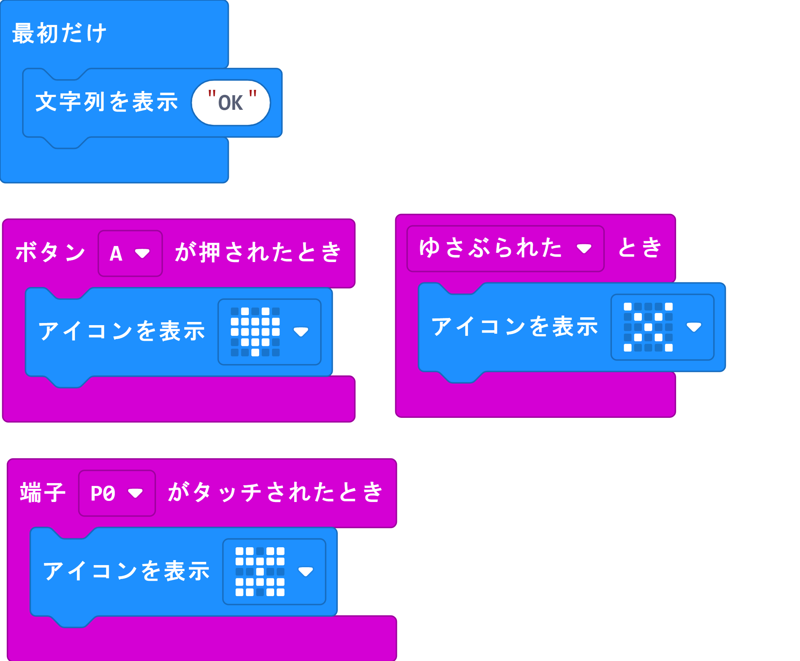
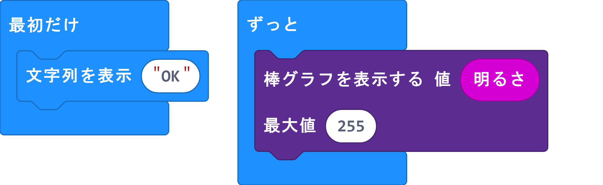
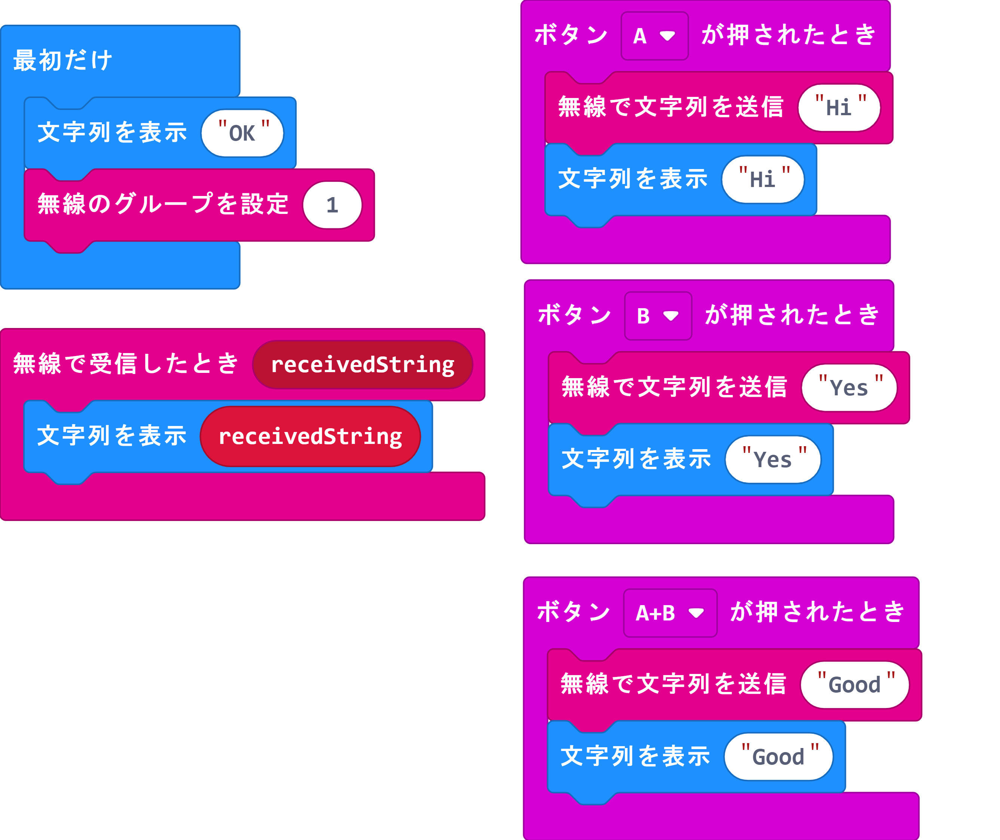

# Micro:bit tutorial

---
### はじめに

Micro:bitのブロックエディターを使って、プログラミングの基本を学びます。

プログラミングの基本は以下の通りです。（一般的なプログラミング言語の教科書に書かれているものです。）

（1）表示：プログラムの結果を表示する方法

（2）繰り返し：プログラムは繰り返し動作が得意ですので、繰り返しを行う方法

（3）条件分岐：ある条件によって動作を変更させる方法

（4）変数：結果などを変数に入れることで他でもその値を利用できるようにする方法

（5）関数：動作をまとめる方法（省略）

（6）イベント：ある入力イベント（ボタンが押されるなど）によって実行する動作を制御する方法

（7）内臓センサー利用：内蔵されているセンサーを利用する方法

（8）無線通信：他のMicrobitと通信する方法

なお、（1）-（6）までは、他の言語にも共通する内容です。
（7）、（8）はマイクロビット独自の機能です。

---

### Lesson 1  LED表示＆繰り返し

MicrobitのLEDを使って表示します。
“最初だけ”ブロックでは、最初の一回のみブロックの中が実行されます。
“ずっと”ブロックでは、繰り返し行われます。(※他のプログラム言語では“ずっと”は“while loop”といわれます。)




```javascript
basic.showString("Hi")
basic.showNumber(0)
basic.forever(function () {
    basic.showIcon(IconNames.Heart)
    basic.showLeds(`
        . . . . .
        . . . . .
        . . . . .
        . . . . .
        . . . . .
        `)
})
```


---
### Lesson 2  変数＆条件分岐＆繰り返し

乱数を使って条件分岐を行います。今回は、さいころ見たいなものを作り、3より小さければYES、3以上であればNOを出力しします。

ここでは、よく使うプログラムの型を3つ使います。

変数：ある値を他でも使いたい場合に使用します。すごく小さい記憶装置（メモ）みたいです。上書きすると前の値は消えてしまいます。（書き込むところと、読みだすところを意識してください。書き込むところはできれば1つが良いです。）

乱数：毎回毎回ランダムな数字を出力します。（さいころみたいなもの）ランダムな数字の範囲を設定することができます。

条件分岐：通常のプログラムではif-else文といわれるものです。if　もし--ならば--どうする。といったものです。条件分岐はいくつも作ることができます。また条件分岐の中に条件分岐を入れることもできますが、多用すると理解しづらくなります。（プログラミング用語ではネスティング、ネスト（入れ子にする）するとも言います。ネストは、2つ（if文の中にif文まで）ぐらいまでが良いとされています。）





```javascript
let x = 0
basic.showString("OK")
basic.forever(function () {
    x = randint(1, 6)
    basic.showNumber(x)
    if (x < 3) {
        basic.showString("Yes")
    } else {
        basic.showString("No")
    }
})
```


---
### Lesson 3  イベント

イベントは、ボタンが押される、傾けるなどのイベントに対応してプログラムを実行します。




```javascript
input.onPinPressed(TouchPin.P0, function () {
    basic.showIcon(IconNames.Butterfly)
})
input.onButtonPressed(Button.A, function () {
    basic.showIcon(IconNames.Heart)
})
input.onGesture(Gesture.Shake, function () {
    basic.showIcon(IconNames.No)
})
basic.showString("OK")
```


---
### Lesson 4 内蔵センサー

Microbitに内蔵されているセンサーの値を表示させます。




```javascript
basic.showString("OK")
basic.forever(function () {
    led.plotBarGraph(
    input.lightLevel(),
    255
    )
})
```


---

### Lesson 5  無線通信

Microbitを2つ使って無線通信を行います。
送信側のAボタンを押すと「Hi」が送信側LEDに「Hi」が表示され、受信側のLEDにも「Hi」が表示されます。



```javascript
input.onButtonPressed(Button.A, function () {
    radio.sendString("Hi")
    basic.showString("Hi")
})
input.onButtonPressed(Button.AB, function () {
    radio.sendString("Good")
    basic.showString("Good")
})
radio.onReceivedString(function (receivedString) {
    basic.showString(receivedString)
})
input.onButtonPressed(Button.B, function () {
    radio.sendString("Yes")
    basic.showString("Yes")
})
basic.showString("OK")
radio.setGroup(1)
```

---
