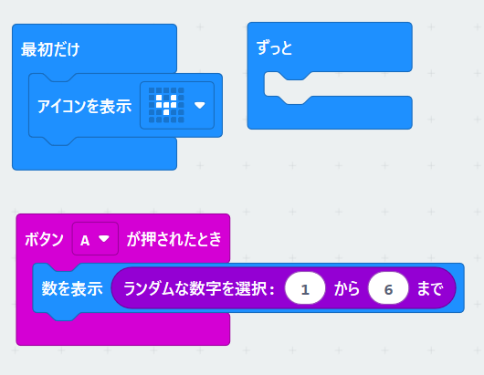
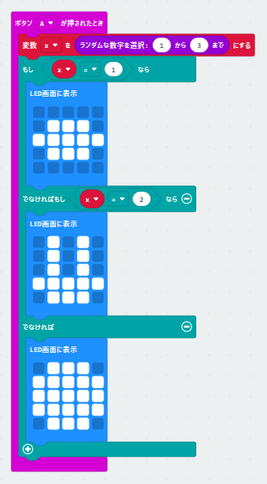
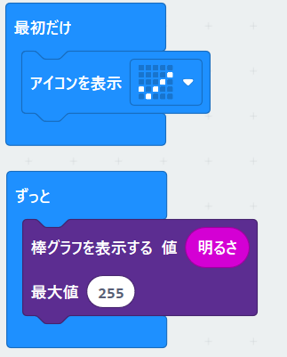
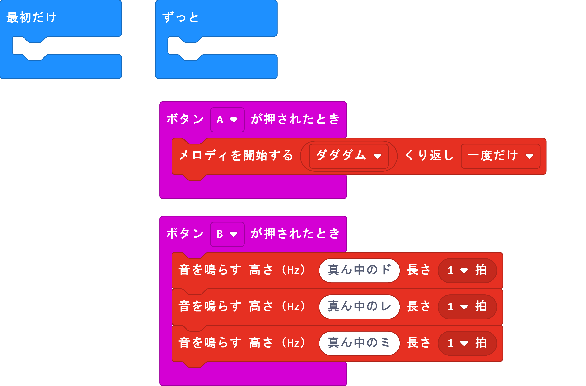
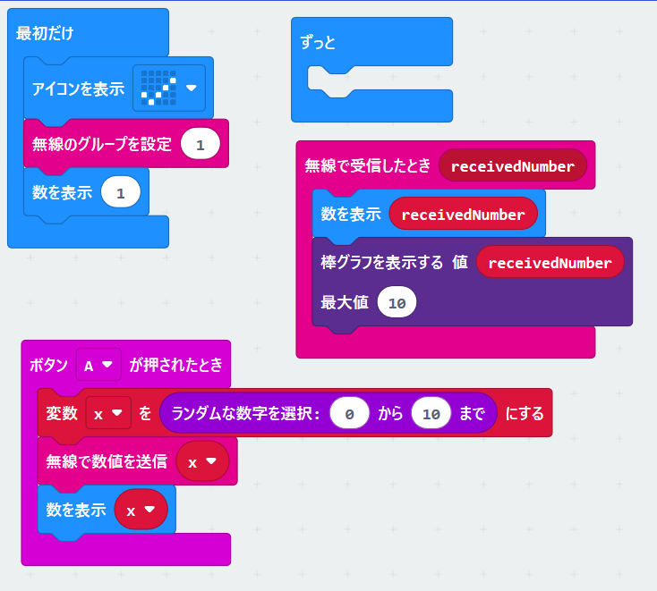
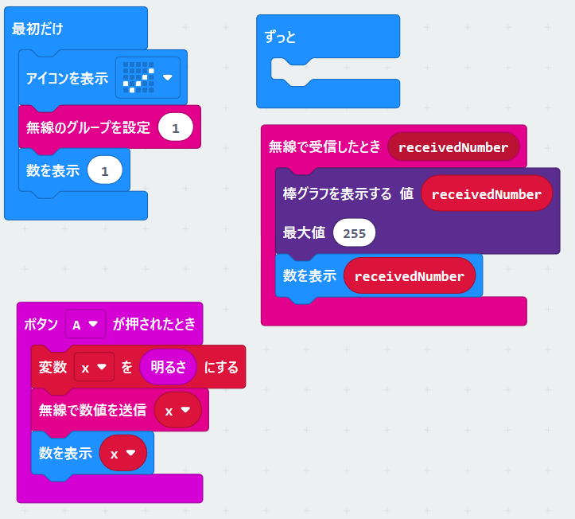

### さいころ

ポイント：イベント処理（Aボタンを押す）、乱数

乱数を使ってさいころの数字を表示します。

Aボタンを押すごとにランダムに数字が表示されます。





```javascript
input.onButtonPressed(Button.A, function () {
    basic.showNumber(randint(1, 6))
})
basic.showIcon(IconNames.SmallHeart)
basic.forever(function () {
	
})

```

------


### じゃんけん

ポイント：変数、条件分岐

このプログラムを作る前に

変数について:

変数とはちょっと難しい言葉ですがすが、一時的に数字や文字を記憶させるメモリーまたは、「メモ帳」のように考えてください。変数の中の情報はいつでも呼び出すことができます。

例えば、こんなプログラムを作ってください。


```Javascript
let x = 0
input.onButtonPressed(Button.A, function () {
    x = randint(0, 9)
    basic.showNumber(x)
})
input.onButtonPressed(Button.B, function () {
    basic.showNumber(x)
})

```


Aボタンを押すと変数Xに数字が書き込まれます。その数字を表示します。

Bボタンを押すと変数Xに書き込まれている数字を見ることができます。

変数は、このように数字や文字を後で使いたいときに一時的に記憶さているものになります。


じゃんけん表示を先ほどの乱数と変数と条件分けで作ってみましょう。



```javascript
let x = 0
input.onButtonPressed(Button.A, function () {
    x = randint(1, 3)
    if (x == 1) {
        basic.showLeds(`
            . . . . .
            . # # # .
            # # # # #
            . # # # .
            . . . . .
            `)
    } else if (x == 2) {
        basic.showLeds(`
            . # . # .
            . # . # .
            . # . # .
            # # # # #
            . # # # .
            `)
    } else {
        basic.showLeds(`
            . # # # .
            # # # # #
            # # # # #
            # # # # #
            . # # # .
            `)
    }
})

```

Aボタンを押すとまず乱数から数字が出てきて変数Xにその数字が入ります。

条件分岐でその数字によって表示するものが変わります。

Aボタンを押すをほかの入力イベントに変更することもできます。

------


### 明るさ測定

Microbitには、いくつかのセンサーがついています。その一つに明るさセンサーが表示LEDのところについています。

明るさ測定器を作ります。

※なおこの明るさ測定は、2019年に太田小にて行われた家庭科の研究授業「快適さとは」に使われました。

[Microbitで明るさ測定 小学校家庭科授業「快適さ」とは](https://qiita.com/Gyutan/items/2d7d356f7321c3d76682)



```
basic.showIcon(IconNames.Yes)
basic.forever(function () {
    led.plotBarGraph(
    input.lightLevel(),
    255
    )
})
```

------

### 音楽を鳴らす

Microbitでは音を鳴らすことができます。
Microbitに既に入っている音を鳴らしてみましょう。

端子0をイヤホンの中心に、端子GNDを外側に接続します。(V2では不要です。)




```javascript
input.onButtonPressed(Button.A, function () {
    music.startMelody(music.builtInMelody(Melodies.Dadadadum), MelodyOptions.Once)
})
input.onButtonPressed(Button.B, function () {
    music.playTone(262, music.beat(BeatFraction.Whole))
    music.playTone(294, music.beat(BeatFraction.Whole))
    music.playTone(330, music.beat(BeatFraction.Whole))
})
basic.forever(function () {
	
})
```

----


### 無線

無線で数字を送ります。



```Javascript
radio.onReceivedNumber(function (receivedNumber) {
    basic.showNumber(receivedNumber)
    led.plotBarGraph(
    receivedNumber,
    10
    )
})
input.onButtonPressed(Button.A, function () {
    x = randint(0, 10)
    radio.sendNumber(x)
    basic.showNumber(x)
})
let x = 0
basic.showIcon(IconNames.Yes)
radio.setGroup(1)
basic.showNumber(1)
basic.forever(function () {
	
})

```

Aボタンを押すと数字が表示され、その後グラフが表示されます。

※送信・受信の際に文字列と数値を送ったかによってコマンドが変わることに注意してください。

数値：`sendNumber`、`receivedNumber`

文字列：`sendString`、`receivedString`

----


### 無線で明るさの測定結果の送信（IoT）

明かるさ測定の値を無線で飛ばします。

先ほどの無線通信のプログラムを２か所変更します。変数の入力を明るさに変更します。

グラフの最大値を255にします。




```javascript
radio.onReceivedNumber(function (receivedNumber) {
    led.plotBarGraph(
    receivedNumber,
    255
    )
    basic.showNumber(receivedNumber)
})
input.onButtonPressed(Button.A, function () {
    x = input.lightLevel()
    radio.sendNumber(x)
    basic.showNumber(x)
})
let x = 0
basic.showIcon(IconNames.Yes)
radio.setGroup(1)
basic.showNumber(1)
basic.forever(function () {
	
})
```
受信者は、無線グループを送信者と同じに設定してください。


------


## カウンター

目的：いろいろなものを数えて表やグラフを作る

Microbitでカウンターを作成します。Aボタンを押すと1増え、ABボタンでゼロにします。

変数を使います。

変数の名前をcountにします。

完成形

[](https://github.com/SGyutan/Microbit_tutorial/blob/master/fig/microbit_count.png)

```
input.onButtonPressed(Button.A, function () {
    count += 1
    if (count == 10) {
        count = 0
    }
    basic.showNumber(count)
})
input.onButtonPressed(Button.AB, function () {
    count = 0
    basic.showNumber(count)
})
let count = 0
count = 0
basic.showNumber(count)
```

最初だけででcountを0にします。この変数の箱の中には0が入ります。

Aボタンを1回押すとcountに1が入ります。もう一度押すと1増えた数が入ります。

このプログラムでは、countが10になると0に戻る条件が入っています。（取り除いてもよいです。）

ボタンABを押すとカウントが0に戻ります。

------


### カウンター+タイマー

今作ったカウンターを改良して、タイマーを作りましょう

Bボタンを押すとカウントダウンが始まります。

[](https://github.com/SGyutan/Microbit_tutorial/blob/master/fig/microbit_count_timer.png)

```
input.onButtonPressed(Button.A, function () {
    count += 1
    if (count == 10) {
        count = 0
    }
    basic.showNumber(count)
})
input.onButtonPressed(Button.AB, function () {
    count = 0
    basic.showNumber(count)
})
input.onButtonPressed(Button.B, function () {
    while (count != 0) {
        basic.pause(500)
        count += -1
        basic.showNumber(count)
    }
})
let count = 0
count = 0
basic.showNumber(count)
```

Bボタンのプログラムは、countが0になるまで繰り返します。（0になると止まる）

一時停止は、プログラムでは500ms（0.5s）としていますが、好きな時間に設定してください。

先ず、Aボタンでカウントする数を決めます。（Aボタンを何回も押す）

次にBボタンを押すとカウントダウンが始まります。最初、countにはAボタンを押した回数の数が入っています。

繰り返しループが回るごとに数をひとつづつ減らしていきます。0になるとこのループは止まります。

```javascript
input.onButtonPressed(Button.A, function () {
    count += 1
    if (count == 10) {
        count = 0
    }
    basic.showNumber(count)
})
input.onButtonPressed(Button.AB, function () {
    count = 0
    basic.showNumber(count)
})
input.onButtonPressed(Button.B, function () {
    while (count != 0) {
        basic.pause(500)
        count += -1
        basic.showNumber(count)
    }
})
let count = 0
count = 0
basic.showNumber(count)
```

------

