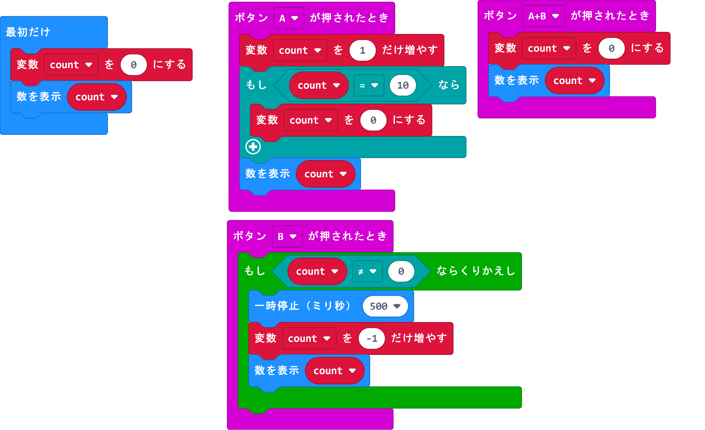
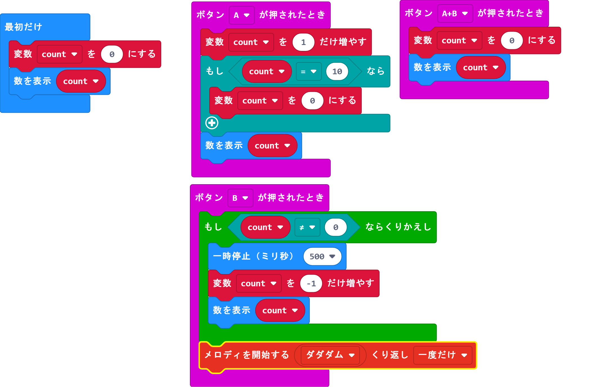
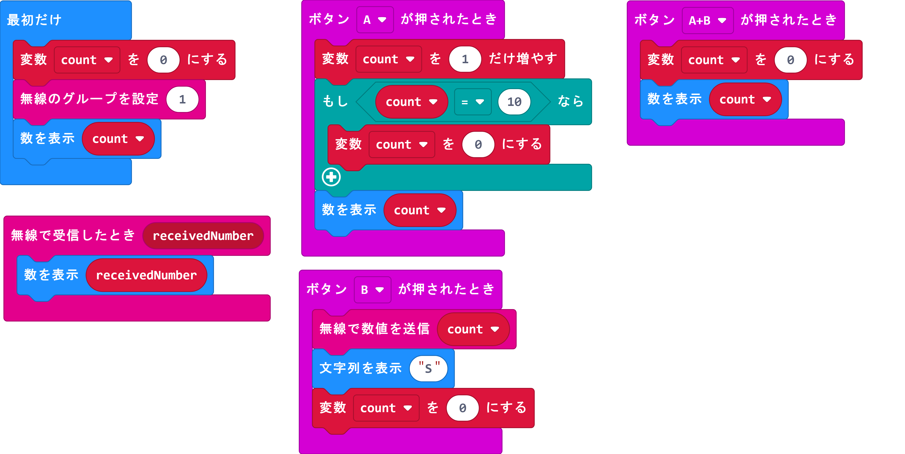
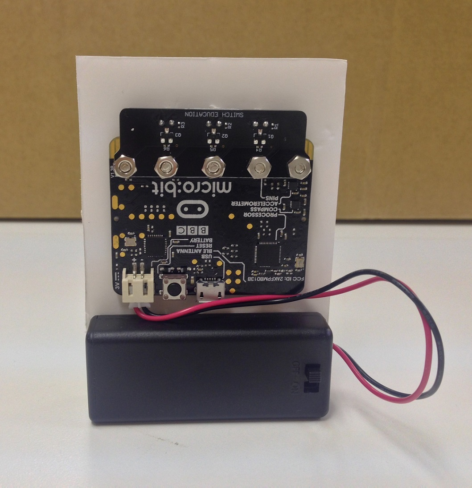
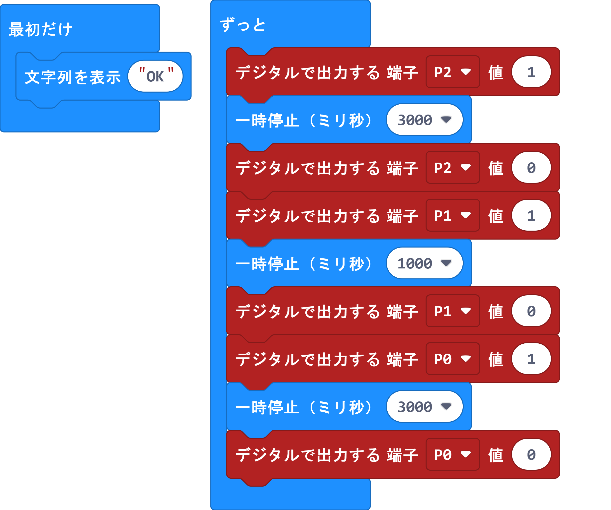

# 授業に使えるかも？プログラム
programing example for making  lecture course

## 「快適さとは」明るさ測定

[Microbitで明るさ測定　小学校家庭科授業「快適さ」とは](https://qiita.com/Gyutan/items/2d7d356f7321c3d76682)

家庭科の単元（5年生対象）で、「快適さ」というテーマで、身の回りの環境（明るさや温度）を測ることで「快適さ」について考える授業での活用方法。

Microbitを使って、明るさや温度を測って、数値化、可視化を行います。

Microbitには、前面のLED25個のところに光センサーが入っています。（「明るさ」センサーはLEDとの兼用。LEDが光っていないのとき「センサー」になる。センサーの数値は「0」〜「255」。）

さらに発展的内容として
測定結果の平均を求める。外れ値がないかどうか考える。グラフの書き方を変えてみる。

---

## カウンター

目的：いろいろなものを数えて表やグラフを作る

Microbitでカウンターを作成します。Aボタンを押すと1増え、ABボタンでゼロにします。

変数を使います。

変数の名前をcountととします。

完成形

最初だけででcountを0にします。この変数の箱の中には0が入ります。

Aボタンを1回押すとcountに1が入ります。もう一度押すと1増えた数が入ります。

このプログラムでは、countが10になると0に戻る条件が入っています。（取り除いてもよいです。）

ボタンABを押すとカウントが0に戻ります。

### カウンター+タイマー

今作ったカウンターを改良して、タイマーを作りましょう

Bボタンを押すとカウントダウンが始まります。

Bボタンのプログラムは、countが0になるまで繰り返します。（0になると止まる）

一時停止は、プログラムでは500ms（0.5s）としていますが、好きな時間に設定してください。

先ず、Aボタンでカウントする数を決めます。（Aボタンを何回も押す）

次にBボタンを押すとカウントダウンが始まります。最初、countにはAボタンを押した回数の数が入っています。

繰り返しループが回るごとに数をひとつづつ減らしていきます。0になるとこのループは止まります。

さらに、スピーカーをつなぐ必要がありますが、カウントダウンが終わったら音を鳴らすようにも改造できます。

Bボタンの中のループを抜けた後に音を鳴らすブロックを置くと、カウントダウンが終わると音が鳴るようになります。

---

## 通信・暗号

目的：通信と暗号の仕組みを理解して、情報セキュリティーについて考える。

Lesson5で無線送信のプログラムを作成しました。送信できるメッセージがボタンの数だけでした。

そこで、遅れるメッセージの種類を増やすために、カウンタープログラムと無線通信プログラムを合わせます。

無線送信では、数字しか送れないので、数字でどのようなメッセージになるか対応表を作ってください。

これが、ある意味、暗号になります。

通信は、第三者に見られる可能性があるので、その内容については、暗号化することが重要です。

（例えば、通信のチャンネルを同じにすると同じチャンネルの人がその内容を見ることができます。）

数字と内容との対応表を作成します。内容（平文）を数字にすることを暗号化といい、数字から内容（平文）に変更するのを復号化といいます。

自分たちで暗号を考えて暗号を見破ってみましょう。

[小学生OK🧐作り方まで徹底解説！簡単＆有名な暗号15種類をクイズ形式で紹介 ](https://menatako.com/basic-cipher)

0-9までの数字に対応する内容を考えてみる。

| 数字 | 内容（平文） |
| ---- | ------------ |
| 0    |              |
| 1    |              |
| 2    |              |
| 3    |              |
| 4    |              |
| 5    |              |
| 6    |              |
| 7    |              |
| 8    |              |
| 9    |              |

カウンターと無線送信のプログラムを合わせた無線送信機を作ります。

Aボタンを押して送る数字を指定します。（送る数字を間違えたときはABボタンでクリアーにできます。）

Bボタンを押して送信します。

無線グループは同じ番号にしないと受信することはできません。

暗号は今の生活のどこに使われているでしょう。

「プライバシー」と「決済」に使われています。

具体的には、インターネット、

買い物（パスワード，クレジットカード番号，個人情情報）

無線LAN、電子メール

ICキャッシュカード，おサイフケータイ

さらには、仮想通貨（暗号通貨）にもブロックチェーン技術として使われています。

ブロックチェーンを理解するには、公開鍵暗号とハッシュ関数の理解が必要です。

[現代暗号](https://www.nii.ac.jp/userdata/shimin/documents/060824_3rdlec.pdf)

---

## 信号機とBitの基本（2進数）

別途。LEDのアタッチメントが必要。

[micro:bit用信号機モジュールキット]( ssci.to/5296)

取り付け方

[青、赤3秒、黄1秒点灯させるプログラム](https://makecode.microbit.org/26266-88237-27504-40035)

外部の端子に信号を送るプログラムです。

Microbitには、大きい端子が4つあります。「0、1、2、3V、GND」

信号機では、「0、1、2」の端子に信号を送ります。これがスイッチの役割になります。

3V、GNDでLEDに電気を送ります。

0がスイッチをOFFにした状態、1がスイッチをONにした状態になります。

それぞれの色に対応する端子番号は以下の通りです。

| 色       | 端子 |
| -------- | ---- |
| 青（緑） | P2   |
| 黄       | P1   |
| 赤       | P0   |

先ず、青を点灯させます。それで3000ms（3s）待ちます。次に青を消して、黄を点灯させます。1000ms待って、黄を消して、赤を点灯させます。3000ms待って、赤を消します。

これが繰り返しループに入っているので、この動作が繰り返されます。

時間をかえてみたり、点灯する順番などを変えるプログラムを作ってみましょう。

信号機はOn/OFFが3つ

赤：止まれ、黄：止まれ（注意）、青：進め　を意味しますが、

3つのランプしかない信号でもっとサインは作れないでしょうか？

他のLEDをつける。点滅させる。

点滅させるプログラム

青を5回点滅するプログラム

回数を指定する繰り返しを使ってプログラムを作ります。

点灯する間隔を変えるプログラムを作ってみましょう。

他のLEDをつけるプログラム

例えば右折のみ、左折のみ、左折と直進。

ランプのONを1、OFFを0とすると

|      | 赤   | 黄   | 青   | 意味           |
| ---- | ---- | ---- | ---- | -------------- |
| 1    | 0    | 0    | 1    | 進め           |
| 2    | 0    | 1    | 0    | 止まれ（注意） |
| 3    | 1    | 0    | 0    | 止まれ         |
| 4    | 0    | 1    | 1    |                |
| 5    | 1    | 0    | 1    |                |
| 6    | 1    | 1    | 0    |                |
| 7    | 1    | 1    | 1    |                |
| 8    | 0    | 0    | 0    |                |

0,1が3つ　8個命令が考えられる。2ｘ2ｘ2＝8
000, 001, 010, 011, 100, 101,  110, 111

（0,1）でと表現するものをBitといいます。または、2進数とも言います。皆さんが日ごろ使っているものは10進数といい、0-9の数字で表現して、10で繰り上がります。

2進数は0,1の数字で表現して、2で繰り上がります。

2進数で3を表そうとすると11になります。4だと100。

1+1は2進数ならば10（いちぜろ）です。10進数ならば当然2ですが。

指10本でいくつ命令が作れるでしょう？

2ｘ2ｘ2ｘ2ｘ2ｘ2ｘ2ｘ2ｘ2ｘ2＝1024

相手にメッセージを伝えるためには、共通のルールがないと正しく伝わりません。

人との会話も同じです。人に正しくメッセージを伝えるのは難しいです。（永遠の課題です。）

---

参考：
http://www.ne.jp/asahi/ja/asd/jaera/

[プログラムによる計測・制御を学ぼう](http://www.hidapio.jp/mbAT/kambAT-t.pdf)

[micro:bitサンプルプログラミング集3.0版](http://mochizuki.la.coocan.jp/downloads/20200114microbit_sampleprogram3_0.pdf)

