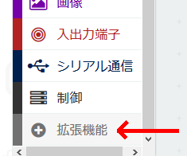
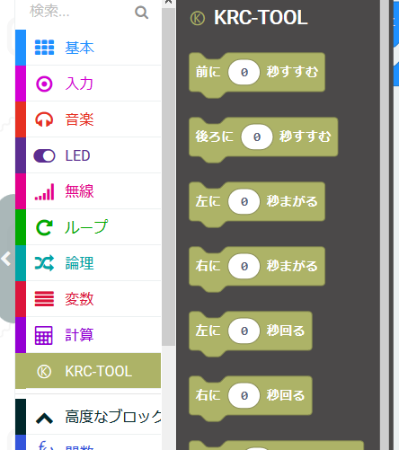

#KRCTOOL拡張ブロック追加方法

あらかじめMicrosoft Storeで「make code」で検索して[make code for micro:bit]をインストールする。

KRCのドライバーのライブラリーファイルを拡張に追加する方法

１．USBから「microbit-pxt-krc-motor-easy.hex」を自分のPCの中にコピーする

２．makecodeを立ち上げ、拡張機能を押す

３．拡張機能の一番下にスクロールし「ファイルを読み込む」を押す

４．「参照」を押してコピーした「microbit-pxt-krc-motor-easy.hex」ファイルを指定して、つづけるを押す

５．KRCTOOLブロックが追加されます

