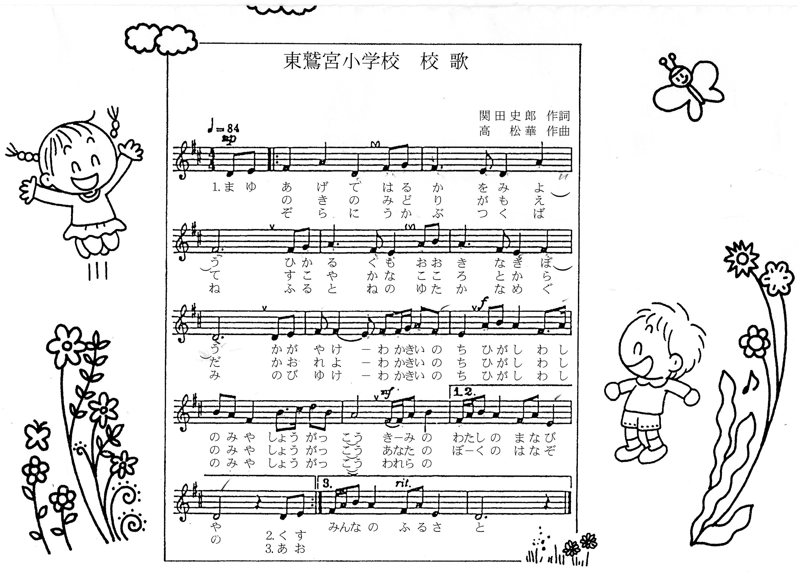
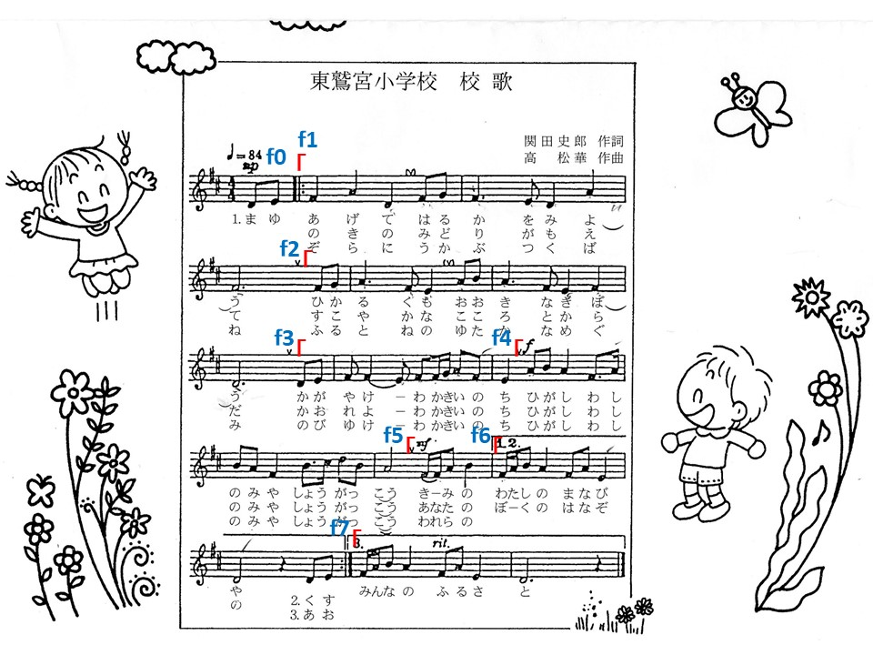
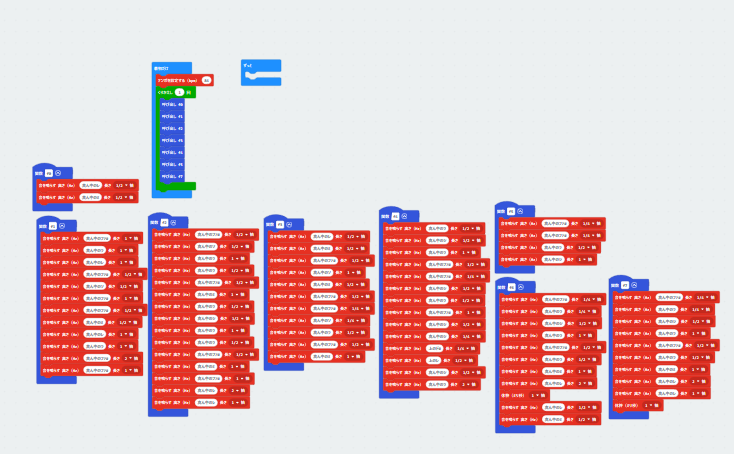
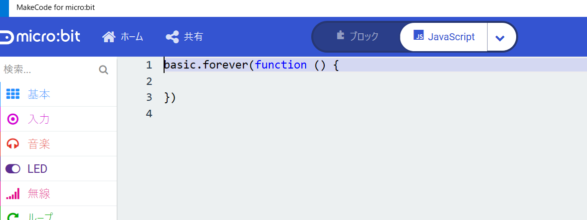

# 東鷲宮校歌をMicrobitでプログラムしよう

### 校歌



#### プログラムのための楽譜の読み方の復習

4/4拍子で、ファとドにシャープ（半音上げる）がついてますのでニ長調です。ファとドの音は半音上げます。

4/4拍子は、１小節の中に４分音符が４つ入ることを意味します。

４分音符は１拍

８分音符は（８分音符２つで４分音符になるので）1/2拍

16分音符は（16分音符２つで8分音符になるので）1/4拍

付点4分音符は、4分音符と8分音符なので、1と1/2拍

付点8分音符は、8分音符と16分音符なので、1/2と1/4拍

付点2分音符は、2分音符と4分音符なので、2と1拍

2分音符は（4分音符が2つなので）2拍

4分休符は1拍

※Microbitでは、タイやスラーは表現できないので、その部分は無視します。強弱（mfやmp）なども今回は無視します。付点表現はできないので、上記のように2つに分けて表現してください。

#### プログラミングの仕方

繰り返しがありますがどのように作っていけばよいでしょうか？

正直に力技で全部打ち込んでいくのも方法としてはあります。プログラミングとは、いかに楽するかを考えることです。同じ部分はなるべく打ち込みたくありません。

同じことを繰り返す場合には、かたまりを部品化すると便利です。

部品化する方法として関数があります。関数を使ってプログラミングしてみましょう。

下の図に関数のまとまりを示す記号が入っています。



曲は、1番は、f0->f1->f2->f3->f4->f5->f6、2番はf1->f2->f3->f4-f5->f6、3番はf1->f2->f3->f4-f5->f7となります。f1->f2->f3->f4->f5までが共通です。この部分をさらに関数にまとめてしまってもよいかもしれません。

1番目の歌詞で終了するならば、f0->f1->f2->f3->f4->f5->f7となります。

関数は部品なので自由に組み合わせることができます。

Microbitで作るとこんな感じになります。青が関数です。



作るのに挫折した人は、MakeCodeの上の方にあるブロックからJavascriptに変更して以下のプログラムをコピーペーストしてください。




#### 完成したプログラム

```javascript
function f0() {
    music.playTone(294, music.beat(BeatFraction.Half))
    music.playTone(330, music.beat(BeatFraction.Half))
}

function f1() {
    music.playTone(370, music.beat(BeatFraction.Whole))
    music.playTone(440, music.beat(BeatFraction.Whole))
    music.playTone(294, music.beat(BeatFraction.Whole))
    music.playTone(370, music.beat(BeatFraction.Half))
    music.playTone(392, music.beat(BeatFraction.Half))
    music.playTone(370, music.beat(BeatFraction.Whole))
    music.playTone(370, music.beat(BeatFraction.Half))
    music.playTone(330, music.beat(BeatFraction.Half))
    music.playTone(294, music.beat(BeatFraction.Whole))
    music.playTone(440, music.beat(BeatFraction.Whole))
    music.playTone(370, music.beat(BeatFraction.Double))
    music.playTone(370, music.beat(BeatFraction.Whole))
}

function f2() {
    music.playTone(370, music.beat(BeatFraction.Half))
    music.playTone(392, music.beat(BeatFraction.Half))
    music.playTone(440, music.beat(BeatFraction.Whole))
    music.playTone(440, music.beat(BeatFraction.Half))
    music.playTone(370, music.beat(BeatFraction.Half))
    music.playTone(330, music.beat(BeatFraction.Whole))
    music.playTone(440, music.beat(BeatFraction.Half))
    music.playTone(494, music.beat(BeatFraction.Half))
    music.playTone(440, music.beat(BeatFraction.Whole))
    music.playTone(440, music.beat(BeatFraction.Half))
    music.playTone(370, music.beat(BeatFraction.Half))
    music.playTone(330, music.beat(BeatFraction.Whole))
    music.playTone(370, music.beat(BeatFraction.Whole))
    music.playTone(294, music.beat(BeatFraction.Double))
    music.playTone(294, music.beat(BeatFraction.Whole))
}

function f3() {
    music.playTone(294, music.beat(BeatFraction.Half))
    music.playTone(330, music.beat(BeatFraction.Half))
    music.playTone(370, music.beat(BeatFraction.Half))
    music.playTone(392, music.beat(BeatFraction.Whole))
    music.playTone(330, music.beat(BeatFraction.Half))
    music.playTone(370, music.beat(BeatFraction.Half))
    music.playTone(370, music.beat(BeatFraction.Quarter))
    music.playTone(392, music.beat(BeatFraction.Quarter))
    music.playTone(440, music.beat(BeatFraction.Half))
    music.playTone(370, music.beat(BeatFraction.Half))
    music.playTone(330, music.beat(BeatFraction.Whole))
}

function f4() {
    music.playTone(440, music.beat(BeatFraction.Half))
    music.playTone(494, music.beat(BeatFraction.Half))
    music.playTone(440, music.beat(BeatFraction.Whole))
    music.playTone(370, music.beat(BeatFraction.Half))
    music.playTone(370, music.beat(BeatFraction.Quarter))
    music.playTone(494, music.beat(BeatFraction.Half))
    music.playTone(440, music.beat(BeatFraction.Half))
    music.playTone(370, music.beat(BeatFraction.Whole))
    music.playTone(494, music.beat(BeatFraction.Half))
    music.playTone(494, music.beat(BeatFraction.Quarter))
    music.playTone(554, music.beat(BeatFraction.Quarter))
    music.playTone(587, music.beat(BeatFraction.Half))
    music.playTone(494, music.beat(BeatFraction.Half))
    music.playTone(440, music.beat(BeatFraction.Double))
}

function f5() {
    music.playTone(370, music.beat(BeatFraction.Quarter))
    music.playTone(370, music.beat(BeatFraction.Quarter))
    music.playTone(440, music.beat(BeatFraction.Half))
    music.playTone(494, music.beat(BeatFraction.Whole))
}

function f6() {
    music.playTone(370, music.beat(BeatFraction.Quarter))
    music.playTone(440, music.beat(BeatFraction.Quarter))
    music.playTone(494, music.beat(BeatFraction.Half))
    music.playTone(440, music.beat(BeatFraction.Whole))
    music.playTone(370, music.beat(BeatFraction.Half))
    music.playTone(440, music.beat(BeatFraction.Half))
    music.playTone(330, music.beat(BeatFraction.Whole))
    music.playTone(294, music.beat(BeatFraction.Double))
    music.rest(music.beat(BeatFraction.Whole))
    music.playTone(294, music.beat(BeatFraction.Half))
    music.playTone(330, music.beat(BeatFraction.Half))
}

function f7() {
    music.playTone(370, music.beat(BeatFraction.Quarter))
    music.playTone(440, music.beat(BeatFraction.Quarter))
    music.playTone(494, music.beat(BeatFraction.Half))
    music.playTone(440, music.beat(BeatFraction.Whole))
    music.playTone(370, music.beat(BeatFraction.Half))
    music.playTone(440, music.beat(BeatFraction.Half))
    music.playTone(330, music.beat(BeatFraction.Whole))
    music.playTone(294, music.beat(BeatFraction.Double))
    music.playTone(294, music.beat(BeatFraction.Whole))
    music.rest(music.beat(BeatFraction.Whole))
}


music.setTempo(84)
for (let index = 0; index < 1; index++) {
    f0()
    f1()
    f2()
    f3()
    f4()
    f5()
    f7()
}
basic.forever(function on_forever() {
    
})

```


