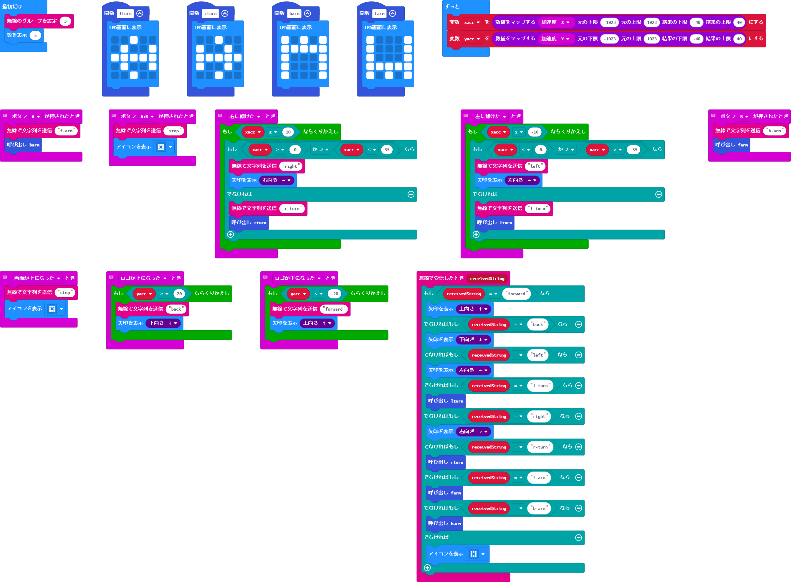
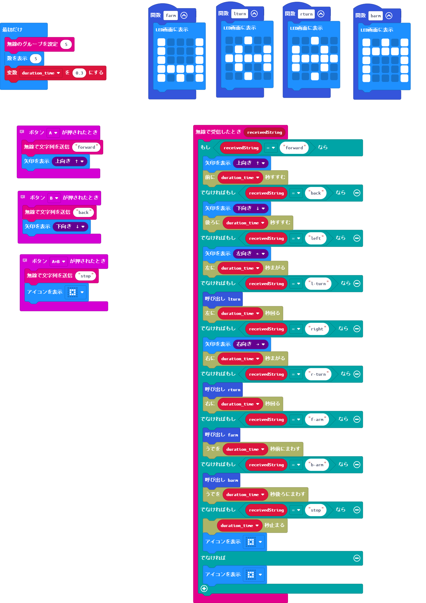

## Microbitを2つ利用して無線コントロール
BLTの機能を使って無線通信を行います。

---

### コントローラー側

通信チャンネルをあらかじめ指定



```python
# stop

def on_gesture_screen_up():
    radio.send_string("stop")
    basic.show_icon(IconNames.SMALL_SQUARE)
input.on_gesture(Gesture.SCREEN_UP, on_gesture_screen_up)

# right

def on_gesture_tilt_right():
    while xacc >= 10:
        if xacc >= 0 and xacc <= 35:
            radio.send_string("right")
            basic.show_arrow(ArrowNames.EAST)
        else:
            radio.send_string("r-turn")
            rturn()
input.on_gesture(Gesture.TILT_RIGHT, on_gesture_tilt_right)

# arm forward

def on_button_pressed_a():
    radio.send_string("f-arm")
    barm()
input.on_button_pressed(Button.A, on_button_pressed_a)

# left

def on_gesture_tilt_left():
    while xacc <= -10:
        if xacc <= 0 and xacc > -35:
            radio.send_string("left")
            basic.show_arrow(ArrowNames.WEST)
        else:
            radio.send_string("l-turn")
            lturn()
input.on_gesture(Gesture.TILT_LEFT, on_gesture_tilt_left)

# back

def on_gesture_logo_up():
    while yacc >= 20:
        radio.send_string("back")
        basic.show_arrow(ArrowNames.SOUTH)
input.on_gesture(Gesture.LOGO_UP, on_gesture_logo_up)

def farm():
    basic.show_leds("""
        # . . . #
        # . . . #
        # . . . #
        # # # # #
        # . # . #
        """)
def lturn():
    basic.show_leds("""
        . . # . .
        . # . . #
        # # # # #
        . # . . #
        . . # . .
        """)
def rturn():
    basic.show_leds("""
        . . # . .
        # . . # .
        # # # # #
        # . . # .
        . . # . .
        """)
# forward

def on_gesture_logo_down():
    while yacc <= -20:
        radio.send_string("forward")
        basic.show_arrow(ArrowNames.NORTH)
input.on_gesture(Gesture.LOGO_DOWN, on_gesture_logo_down)

# stop press ab

def on_button_pressed_ab():
    radio.send_string("stop")
    basic.show_icon(IconNames.SMALL_SQUARE)
input.on_button_pressed(Button.AB, on_button_pressed_ab)

def barm():
    basic.show_leds("""
        # . # . #
        # # # # #
        # . . . #
        # . . . #
        # . . . #
        """)

def on_received_string(receivedString):
    if receivedString == "forward":
        basic.show_arrow(ArrowNames.NORTH)
    elif receivedString == "back":
        basic.show_arrow(ArrowNames.SOUTH)
    elif receivedString == "left":
        basic.show_arrow(ArrowNames.WEST)
    elif receivedString == "l-turn":
        lturn()
    elif receivedString == "right":
        basic.show_arrow(ArrowNames.EAST)
    elif receivedString == "r-turn":
        rturn()
    elif receivedString == "f-arm":
        farm()
    elif receivedString == "b-arm":
        barm()
    else:
        basic.show_icon(IconNames.SMALL_SQUARE)
radio.on_received_string(on_received_string)

# arm back

def on_button_pressed_b():
    radio.send_string("b-arm")
    farm()
input.on_button_pressed(Button.B, on_button_pressed_b)

yacc = 0
xacc = 0
radio.set_group(5)
basic.show_number(5)

def on_forever():
    global xacc, yacc
    xacc = Math.map(input.acceleration(Dimension.X), -1023, 1023, -40, 40)
    yacc = Math.map(input.acceleration(Dimension.Y), -1023, 1023, -40, 40)
basic.forever(on_forever)
```
---

### ロボット側





```python
# arm forward

def on_button_pressed_a():
    radio.send_string("forward")
    basic.show_arrow(ArrowNames.NORTH)
input.on_button_pressed(Button.A, on_button_pressed_a)

def farm():
    basic.show_leds("""
        # . . . #
        # . . . #
        # . . . #
        # # # # #
        # . # . #
        """)
def lturn():
    basic.show_leds("""
        . . # . .
        . # . . #
        # # # # #
        . # . . #
        . . # . .
        """)
def rturn():
    basic.show_leds("""
        . . # . .
        # . . # .
        # # # # #
        # . . # .
        . . # . .
        """)
# stop press ab

def on_button_pressed_ab():
    radio.send_string("stop")
    basic.show_icon(IconNames.SMALL_SQUARE)
input.on_button_pressed(Button.AB, on_button_pressed_ab)

def barm():
    basic.show_leds("""
        # . # . #
        # # # # #
        # . . . #
        # . . . #
        # . . . #
        """)

def on_received_string(receivedString):
    if receivedString == "forward":
        basic.show_arrow(ArrowNames.NORTH)
        KRCmotor.fwd_go(duration_time)
    elif receivedString == "back":
        basic.show_arrow(ArrowNames.SOUTH)
        KRCmotor.rev_go(duration_time)
    elif receivedString == "left":
        basic.show_arrow(ArrowNames.WEST)
        KRCmotor.left_turn(duration_time)
    elif receivedString == "l-turn":
        lturn()
        KRCmotor.left_spin(duration_time)
    elif receivedString == "right":
        basic.show_arrow(ArrowNames.EAST)
        KRCmotor.right_turn(duration_time)
    elif receivedString == "r-turn":
        rturn()
        KRCmotor.right_spin(duration_time)
    elif receivedString == "f-arm":
        farm()
        KRCmotor.fwd_rotate(duration_time)
    elif receivedString == "b-arm":
        barm()
        KRCmotor.rev_rotate(duration_time)
    elif receivedString == "stop":
        KRCmotor.stop_all(duration_time)
        basic.show_icon(IconNames.SMALL_SQUARE)
    else:
        basic.show_icon(IconNames.SMALL_SQUARE)
radio.on_received_string(on_received_string)

# arm forward

def on_button_pressed_b():
    radio.send_string("back")
    basic.show_arrow(ArrowNames.SOUTH)
input.on_button_pressed(Button.B, on_button_pressed_b)

duration_time = 0
radio.set_group(5)
basic.show_number(5)
duration_time = 0.3
```
---
